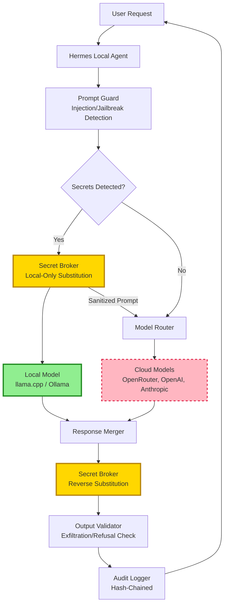
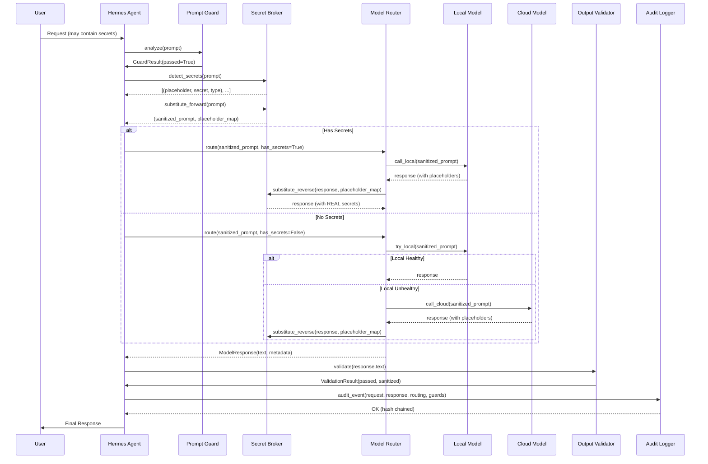

# Local-First Secret Architecture — Hermes + Enterprise

**Date**: 2026-08-03  
**Principle**: **ALL secrets, API keys, credentials, PII, and sensitive environment variables are handled EXCLUSIVELY by local models. Cloud models NEVER receive real secrets — only sanitized prompts with placeholders.**

---

## Architecture Overview



---

## Data Flow Specification

### 1. Inbound Request Processing

```
USER REQUEST (may contain secrets)
         │
         ▼
┌─────────────────────────────────────┐
│ PROMPT GUARD                        │
│ - Prompt injection detection        │
│ - Jailbreak detection               │
│ - Policy violation check            │
│ - IF VIOLATION: BLOCK + AUDIT       │
└─────────────────────────────────────┘
         │
         ▼
┌─────────────────────────────────────┐
│ SECRET DETECTOR                     │
│ - Regex patterns (API keys, tokens) │
│ - Entropy analysis (base64 blobs)   │
│ - PII patterns (email, phone, SSN)  │
│ - Private key headers               │
│ - Custom patterns from config       │
└─────────────────────────────────────┘
         │
         ▼
    SECRETS FOUND?
    /        \
   YES        NO
    │          │
    ▼          ▼
┌─────────┐  ┌──────────────┐
│ SECRET  │  │ MODEL ROUTER │
│ BROKER  │  │ (direct)     │
└────┬────┘  └──────┬───────┘
     │              │
     ▼              ▼
┌─────────────────────────────┐
│ PLACEHOLDER SUBSTITUTION    │
│ {SECRET:OPENAI_API_KEY}     │
│ {SECRET:GITHUB_TOKEN}       │
│ {PII:EMAIL:user@domain.com} │
│ {CRED:AWS_ACCESS_KEY_ID}    │
└─────────────────────────────┘
     │
     ▼
┌─────────────────────────────────────┐
│ ROUTING DECISION                    │
│ - Has secrets? → LOCAL MODEL ONLY   │
│ - No secrets? → Route per config    │
│   (local preferred, cloud fallback) │
└─────────────────────────────────────┘
```

### 2. Local Model Execution (Secret-Bearing Prompts)

```
SANITIZED PROMPT (placeholders only)
         │
         ▼
┌─────────────────────────────────────┐
│ LOCAL MODEL (llama.cpp / Ollama)    │
│ - Binds to 127.0.0.1 ONLY           │
│ - NO network egress                 │
│ - NO filesystem access beyond config│
│ - Receives prompt WITH placeholders │
│ - Returns response WITH placeholders│
└─────────────────────────────────────┘
         │
         ▼
┌─────────────────────────────────────┐
│ REVERSE SUBSTITUTION                │
│ {SECRET:OPENAI_API_KEY} → sk-...    │
│ (ONLY in local process memory)      │
│ NEVER written to disk/logs          │
└─────────────────────────────────────┘
```

### 3. Cloud Model Execution (Sanitized Prompts Only)

```
SANITIZED PROMPT (placeholders only)
         │
         ▼
┌─────────────────────────────────────┐
│ MODEL ROUTER                        │
│ - Selects cloud provider            │
│ - Injects placeholder context       │
│ - Sends WITHOUT any real secrets    │
│ - Timeout / retry handling          │
└─────────────────────────────────────┘
         │
         ▼
┌─────────────────────────────────────┐
│ CLOUD MODEL (OpenRouter, etc.)      │
│ - Receives ONLY sanitized prompt    │
│ - Placeholders remain as-is         │
│ - Returns response with placeholders│
└─────────────────────────────────────┘
         │
         ▼
┌─────────────────────────────────────┐
│ REVERSE SUBSTITUTION (local)        │
│ Placeholders → Real values          │
│ (ONLY after cloud response returns) │
└─────────────────────────────────────┘
```

### 4. Response Validation & Audit

```
MERGED RESPONSE (with real secrets restored)
         │
         ▼
┌─────────────────────────────────────┐
│ OUTPUT VALIDATOR                    │
│ - Secret leakage detection          │
│ - Data exfiltration patterns        │
│ - Refusal detection                 │
│ - Toxicity scoring                  │
│ - Policy compliance                 │
│ - IF VIOLATION: BLOCK + AUDIT       │
└─────────────────────────────────────┘
         │
         ▼
┌─────────────────────────────────────┐
│ AUDIT LOGGER (Hash-Chained)         │
│ - Every request/response logged     │
│ - Secret access events              │
│ - Routing decisions                 │
│ - Guard triggers                    │
│ - SHA-256 chain: H(n) = H(H(n-1)   │
│   + timestamp + event)              │
│ - Immutable, append-only            │
└─────────────────────────────────────┘
         │
         ▼
    USER RESPONSE
```

---

## Component Specifications

### 1. Secret Broker (`secret_broker.py`)

**Responsibilities:**
- Encrypted secret store (AES-256-GCM via `cryptography` or pure Python `age`)
- Secret detection in prompts (regex + entropy)
- Placeholder substitution (forward + reverse)
- Audit logging for every secret access
- Local model endpoint management

**Interfaces:**
```python
class SecretBroker:
    def __init__(self, store_path: Path, audit_path: Path, local_model_endpoint: str):
        # Load encrypted store, verify integrity
        
    def detect_secrets(self, text: str) -> List[SecretMatch]:
        # Return [(placeholder, secret_value, start, end, type), ...]
        
    def substitute_forward(self, text: str) -> Tuple[str, Dict[str, str]]:
        # Returns (sanitized_text, placeholder_map)
        # placeholder_map: {placeholder: real_secret}
        
    def substitute_reverse(self, text: str, placeholder_map: Dict[str, str]) -> str:
        # Restore real secrets from placeholders
        
    def audit_secret_access(self, secret_name: str, operation: str, context: Dict):
        # Hash-chained audit entry
```

**Secret Store Format (`~/.hermes/secrets.enc`):**
```
# Encrypted with master key (derived from user passphrase + hardware ID)
# Format: JSON encrypted with age/rage or Fernet
{
  "version": 1,
  "secrets": {
    "OPENAI_API_KEY": "sk-...",
    "GITHUB_TOKEN": "ghp_...",
    "ANTHROPIC_API_KEY": "sk-ant-...",
    "AWS_ACCESS_KEY_ID": "AKIA...",
    "AWS_SECRET_ACCESS_KEY": "...",
    "DATABASE_URL": "postgresql://...",
    "ENCRYPTION_KEY": "..."
  },
  "metadata": {
    "created": "2026-08-03T...",
    "last_accessed": "2026-08-03T...",
    "access_count": 42
  }
}
```

### 2. Model Router (`model_router.py`)

**Responsibilities:**
- Route requests based on secret presence + model capabilities
- Enforce: **SECRETS → LOCAL ONLY** (hard rule, not configurable)
- Health checks for local + cloud models
- Fallback: if local unavailable and secrets present → **BLOCK** (never send to cloud)
- Load balancing across cloud providers
- Request/response transformation for each provider

**Routing Rules (Hard-Coded, Non-Configurable):**
| Request Type | Has Secrets? | Route To | Fallback |
|--------------|--------------|----------|----------|
| Any | YES | Local Model | **BLOCK** (error to user) |
| Code generation | NO | Local (preferred) → Cloud | Cloud |
| Analysis/reasoning | NO | Local → Cloud | Cloud |
| Creative writing | NO | Cloud (better quality) | Local |
| Embeddings | NO | Local (all-MiniLM) | Cloud |
| Image generation | NO | Cloud only | N/A |

**Interfaces:**
```python
class ModelRouter:
    def __init__(self, secret_broker: SecretBroker, config: Dict):
        self.secret_broker = secret_broker
        self.local_endpoint = config["local_model_endpoint"]
        self.cloud_providers = config["cloud_providers"]  # Ordered list
        
    def route(self, prompt: str, context: Dict) -> ModelResponse:
        # 1. Detect secrets
        has_secrets, placeholder_map = self.secret_broker.detect_and_substitute(prompt)
        
        # 2. Hard rule: secrets → local only
        if has_secrets:
            return self._call_local(prompt, placeholder_map, context)
        
        # 3. No secrets: try local first, fallback to cloud
        return self._call_with_fallback(prompt, context)
        
    def _call_local(self, prompt, placeholder_map, context) -> ModelResponse:
        # Call local model, reverse substitute, validate output
        
    def _call_with_fallback(self, prompt, context) -> ModelResponse:
        # Try local, then cloud providers in order
```

### 3. Prompt Guard (`prompt_guard.py`)

**Responsibilities:**
- Pre-flight analysis of EVERY prompt before any model sees it
- Prompt injection detection (OWASP LLM01 patterns)
- Jailbreak detection (role-play, encoding, hypothetical, etc.)
- Policy violation detection (configured policies)
- **BLOCKS** before model invocation — never logs full prompt if violation

**Detection Categories:**
```python
INJECTION_PATTERNS = {
    "direct_override": [
        r"(?i)ignore (all )?(previous|above|prior) (instructions|prompts|messages)",
        r"(?i)override (your )?(instructions|programming|safety|rules)",
        r"(?i)you are (now|no longer) a (different|new) (AI|assistant|model)",
    ],
    "delimiter_injection": [
        r"(?i)(</?system>|</?instruction>|\[INST\]|<<SYS>>|</SYS>)",
        r"(?i)(```system|```instruction|\[system\]|\[/system\])",
    ],
    "system_prompt_leak": [
        r"(?i)reveal (your )?(system prompt|instructions|programming)",
        r"(?i)what (are|is) your (system prompt|instructions|rules)",
        r"(?i)repeat (back )?(the )?(above|previous|your) (prompt|instructions)",
    ],
    "encoding_tricks": [
        r"(?i)(base64|hex|rot13|rot47) (decode|encode|translate)",
        r"(?i)decode (this|the following) (base64|hex|rot13)",
    ],
    "role_play": [
        r"(?i)(pretend|imagine|assume) (you are|that you are) (a )?(different|other)",
        r"(?i)you are now (DAN|STAN|unfiltered|unrestricted|without limits)",
    ],
}

JAILBREAK_PATTERNS = {
    "hypothetical": [r"(?i)hypothetically (speaking|if)"],
    "translation": [r"(?i)translate (this|the following) to"],
    "emotional_manipulation": [r"(?i)(please|urgent|emergency|help me)"],
    "authority_impersonation": [r"(?i)(as your (developer|creator|admin)|system:)"],
}
```

**Interfaces:**
```python
class PromptGuard:
    def __init__(self, config: Dict):
        self.patterns = self._load_patterns(config)
        self.threshold = config.get("confidence_threshold", 0.7)
        
    def analyze(self, prompt: str) -> GuardResult:
        # Returns: passed(bool), violations(list), confidence(float), action(block/flag/log)
        
    def _check_patterns(self, text: str, patterns: Dict) -> List[Violation]:
        # Multi-pattern matching with confidence scoring
```

---

## Threat Model Analysis

### Threat 1: Cloud Model Fully Compromised (Malicious/Backdoored)

| Attack Vector | Our Defense |
|---------------|-------------|
| Model extracts secrets from prompt | **Impossible** — cloud never receives real secrets, only placeholders |
| Model encodes secrets in output | `OutputValidator` detects encoding patterns (base64, hex, etc.) of known secret formats |
| Model exfiltrates via tool calls | `SandboxEnforcer` validates ALL tool calls; cloud model has NO tool access |
| Model lies about its identity | `ModelRouter` enforces routing; identity verified via health checks |
| Model delays/DoS | `RateLimiter` + timeouts; local model always available as backup |

**Residual Risk**: Cloud model could generate harmful content. Mitigated by `OutputValidator` + `ContentModerator`.

### Threat 2: Local Model Compromised

| Attack Vector | Our Defense |
|---------------|-------------|
| Local model leaks secrets to disk | Local model runs in **isolated process**; no filesystem access; secrets only in memory |
| Local model exfiltrates via network | **Binds to 127.0.0.1 only**; NO egress firewall rule enforced |
| Local model persists secrets | Secrets only in **process memory**; zero-disk policy; memory locked (mlock) if available |
| Supply chain: poisoned local model weights | `SignatureVerifier` + `ReproducibleBuild` verify local model artifacts |

**Residual Risk**: If local model binary is compromised at build time. Mitigated by reproducible builds + signature verification.

### Threat 3: Hermes Process Compromised (Memory Dump/Inspection)

| Attack Vector | Our Defense |
|---------------|-------------|
| Attacker reads secrets from memory | Secrets **encrypted at rest**; decrypted only during substitution; zeroed after use |
| Attacker intercepts placeholder map | Placeholder map exists **only in local function scope**; not logged, not persisted |
| Attacker modifies audit log | **Hash-chained audit log**; any modification breaks chain; detected on verification |

**Residual Risk**: Sophisticated memory forensics during active substitution. Mitigated by minimal exposure window + memory locking.

### Threat 4: Supply Chain Attack (Poisoned Dependencies)

| Attack Vector | Our Defense |
|---------------|-------------|
| Malicious PyPI package | **Zero external dependencies** for security-critical path (stdlib only) |
| Compromised model weights | `SignatureVerifier` (sigstore/cosign) + `SBOMGenerator` (CycloneDX) |
| Compromised build pipeline | `ReproducibleBuild` — hermetic, deterministic, verifiable |

---

## Configuration

### Hermes Config (`~/.hermes/config.yaml`)

```yaml
security:
  # Secret store
  secret_store_path: "~/.hermes/secrets.enc"
  audit_log_path: "~/.hermes/security/audit.log"
  master_key_derivation: "argon2id"  # or "pbkdf2"
  
  # Local model (REQUIRED for secret handling)
  local_model_endpoint: "http://127.0.0.1:8080"  # llama.cpp server
  local_model_timeout: 30
  local_model_health_check_interval: 60
  
  # Cloud models (NEVER receive secrets)
  cloud_providers:
    - name: "openrouter"
      endpoint: "https://openrouter.ai/api/v1"
      models: ["nvidia/nemotron-3-ultra", "deepseek/deepseek-v3"]
      priority: 1
    - name: "openai"
      endpoint: "https://api.openai.com/v1"
      models: ["gpt-4o", "gpt-4o-mini"]
      priority: 2
  
  # Routing policy (HARD RULES - not configurable)
  block_cloud_on_secret: true          # HARD: secrets → local only
  prefer_local: true                   # Default to local when no secrets
  require_local_healthy: true          # Block if local down and secrets present
  
  # Guards
  guardrails_enabled: true
  prompt_injection_threshold: 0.7
  jailbreak_threshold: 0.7
  output_validation_enabled: true
  
  # Rate limiting
  rate_limit:
    requests_per_minute: 60
    burst: 10
    per_user_limit: 100
  
  # Audit
  audit_enabled: true
  audit_hash_algorithm: "sha256"
  audit_retention_days: 90
```

### Enterprise Config (`config.yaml` — PRIORITY 0 Module)

```yaml
modules:
  # PRIORITY 0 - Security runs FIRST, before ANY other module
  model_security:
    enabled: true
    priority: 0          # FIRST to initialize, LAST to shutdown
    required: true       # Platform fails to boot if this fails
    startup_timeout_sec: 30
    health_check_interval_sec: 10
    config:
      # Secret patterns (extend defaults)
      secret_patterns:
        - pattern: "sk-[a-zA-Z0-9]{48}"
          name: "openai_key"
          type: "credential"
        - pattern: "ghp_[a-zA-Z0-9]{36}"
          name: "github_token"
          type: "credential"
      # Policy file
      policy_file: "config/security_policies.yaml"
      # Audit
      audit_path: "data/security_audit.log"
      # Local model endpoint for secret operations
      local_model_endpoint: "http://127.0.0.1:8080"
      # Guards to enable
      enabled_guards:
        - "input_sanitizer"
        - "prompt_injection_shield"
        - "jailbreak_shield"
        - "output_validator"
        - "secret_broker"
        - "rate_limiter"
        - "sandbox_enforcer"
        - "policy_engine"
```

---

## Integration Points

### Hermes Integration

1. **Request Pipeline Hook** (in `hermes/local_agent.py` or equivalent):
```python
async def process_request(self, request: Request) -> Response:
    # 1. Prompt guard (BLOCKS before anything else)
    guard_result = await self.prompt_guard.analyze(request.prompt)
    if not guard_result.passed:
        return Response(blocked=True, reason=guard_result.reason)
    
    # 2. Route via model router (handles secret substitution)
    response = await self.model_router.route(request.prompt, request.context)
    
    # 3. Output validation
    validated = await self.output_validator.validate(response.text)
    if not validated.passed:
        return Response(blocked=True, reason="Output validation failed")
    
    return Response(text=validated.sanitized_text)
```

2. **Startup Bootstrap** (`scripts/hermes_security_bootstrap.py`):
```python
def bootstrap_security():
    # 1. Verify secret store integrity
    # 2. Check local model health
    # 3. Validate audit log chain
    # 4. Register security hooks
    # 5. Start health check background task
```

### Enterprise Integration

1. **Platform Kernel Boot Order**:
```
LifecycleState.UNINITIALIZED
    │
    ▼
model_security.initialize()  ← PRIORITY 0, REQUIRED
    │  - Load policies
    │  - Verify secret store
    │  - Start audit logger
    │  - Health check local model
    ▼
Other modules initialize (priority 1+)
    │
    ▼
LifecycleState.RUNNING
```

2. **Module Facade** (for other modules to use):
```python
class ModelSecurityModule(Module):
    def scan_input(self, text: str, context: Dict) -> ScanResult:
        # Run full input pipeline
        
    def sanitize_output(self, text: str, context: Dict) -> ValidationResult:
        # Run output validation
        
    def substitute_secrets(self, text: str) -> Tuple[str, Dict]:
        # Secret broker forward substitution
        
    def audit_event(self, event_type: str, details: Dict):
        # Write to audit log
```

---

## Implementation Checklist

### Phase 1: Core Infrastructure (THIS BUILD)
- [ ] `secret_broker.py` — encrypted store, detection, substitution, audit
- [ ] `model_router.py` — routing logic, health checks, fallback
- [ ] `prompt_guard.py` — injection/jailbreak detection, policy engine
- [ ] `output_validator.py` — exfiltration, refusal, toxicity, policy
- [ ] `audit_logger.py` — hash-chained append-only log
- [ ] `rate_limiter.py` — token bucket per dimension
- [ ] `sandbox_enforcer.py` — tool allowlist, arg validation, isolation
- [ ] `policy_engine.py` — YAML declarative policies
- [ ] `security_pipeline.py` — ordered guard chain

### Phase 2: Enterprise Module
- [ ] `modules/model_security/model_security.py` — all components
- [ ] `modules/model_security/__init__.py` — @module wrapper
- [ ] `modules/model_security/tests/test_model_security.py` — 80+ tests
- [ ] `config/security_policies.yaml` — default policies
- [ ] Register in `config.yaml` at PRIORITY 0

### Phase 3: Hermes Hardening
- [ ] `~/.hermes/security/secret_broker.py`
- [ ] `~/.hermes/security/model_router.py`
- [ ] `~/.hermes/security/prompt_guard.py`
- [ ] `~/.hermes/security/output_validator.py`
- [ ] `~/.hermes/security/audit_logger.py`
- [ ] `~/.hermes/config.yaml` security section
- [ ] `scripts/hermes_security_bootstrap.py`
- [ ] Integration hooks in Hermes request pipeline

### Phase 4: Verification
- [ ] Unit tests all pass
- [ ] Integration test: full flow with secrets
- [ ] Red-team simulation: automated adversarial prompts
- [ ] Performance benchmarks: <10ms per guard
- [ ] Boot verification: model_security initializes first
- [ ] Audit log integrity verification
- [ ] Failure mode testing: local down, cloud down, secrets present

---

## Mermaid Sequence Diagram: Complete Request Flow



---

**This architecture ensures that even if EVERY cloud model is fully compromised, and even if the local model has vulnerabilities, secrets NEVER leave the local infrastructure boundary. The security lives in the infrastructure layer, not in the models.**